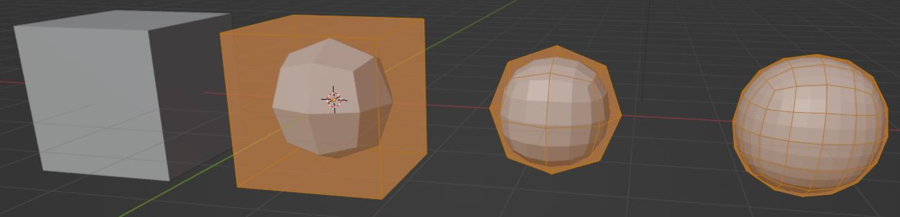
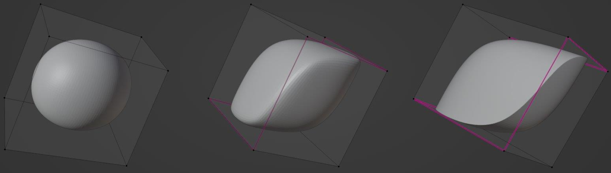
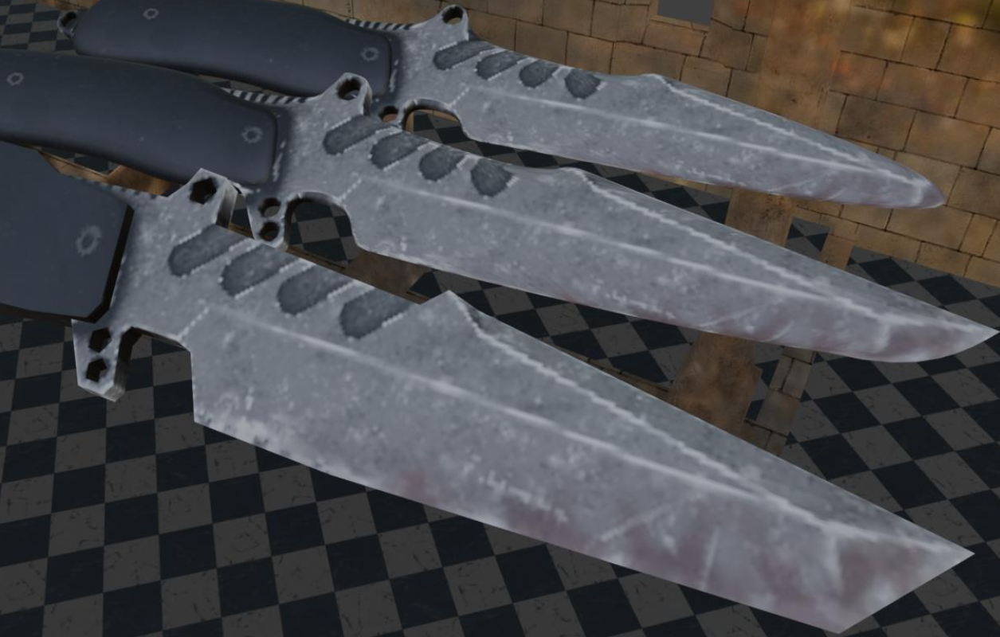
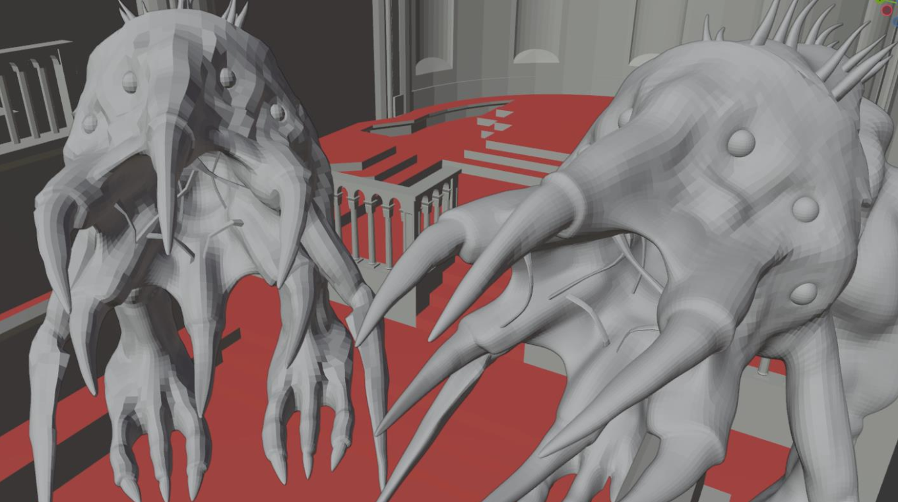
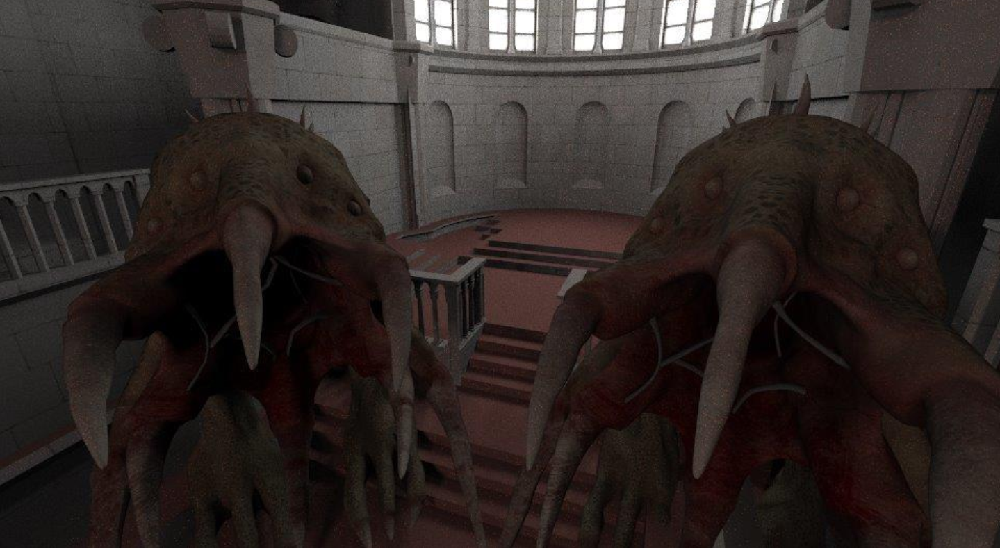

# Subdivision Pipeline

This repository contains an implementation of the Catmull-Clark subdivision surface algorithm.
The implementation supports infinetly-sharp and semi-sharp creases, extraordinary primitives (triangles, n-gons)
and a parser for an extended OBJ format used in [OpenSubdiv](https://graphics.pixar.com/opensubdiv/docs/intro.html)'s provided demo models.

## Examples

### Iterative subdivision of a cube

### Smooth, semi-sharp and infinitely-sharp edges

### Comparison of base mesh (front), smooth subdivision (back) and usage of creases (middle)

### Aliens with different subdivision levels

### Aliens rendered with Direct Illumination

